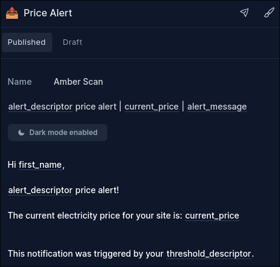

# Simple Energy Price Monitor

A web application that monitors Amber Electric prices and renewable energy percentages, sending alerts through Loops.so based on user-defined thresholds.

## Overview

This application allows users to:
- Monitor real-time electricity prices from Amber Electric
- Set custom price thresholds for high and low electricity prices
- Set renewable energy percentage thresholds
- Receive email notifications via Loops.so when thresholds are crossed
- Configure quiet hours to prevent notifications during certain times
- Set their timezone for localized notifications

## Project Structure

```
amber-scan-simple/
├── .env                 # Environment variables and API keys
├── schema.sql          # SQLite database schema
├── query.sql           # SQL queries reference
├── server.js           # Main server application
├── index.html          # Frontend user interface
├── styles.css          # CSS styling
├── package.json        # Project dependencies
└── amber-general.md    # General documentation
```

## Prerequisites

- Node.js (v14 or higher)
- Modern web browser
- Loops.so account for notifications
- Amber Electric API access

## Installation

1. Clone the repository:
   ```bash
   git clone https://github.com/o6elisk/amber-scan-simple
   cd amber-scan-simple
   ```

2. Install dependencies:
   ```bash
   npm install
   ```

3. Find the `.env.example` file with and update the values to suit. after updating, rename the file to `.env`

## Loops.so Setup

1. Create a Loops.so account at https://loops.so

2. Get your API key:
   - Go to Account Settings
   - Copy your API key
   - Add it to LOOPS_API_KEY in .env

3. Create a Transactional Email Template:
   - Go to Transactional Emails
   - Create a new template
   - Required variables:
     - first_name
     - alert_descriptor
     - current_price
     - threshold_descriptor
     - alert_message
   - Copy the template ID
   - Add it to LOOPS_TEMPLATE_ID in .env

   Example template:
   

## Running the Application

1. Start the server:
   ```bash
   npm start
   ```

   The server will:
   - Automatically create and connect to amber-monitor.sqlite database
   - Run price checks every 30 minutes
   - Log all operations in debug mode

## Configuration Details

### Server Settings
- Default port: 3000
- Host: localhost
- Timezone: UTC (configurable but conversions for timezones are set in `server.js`)
- Debug mode: Configurable via DEBUG environment variable
- Retry logic for API calls
- Detailed logging system
- Cron job: Runs every 30 minutes
- Retry logic: 3 attempts with exponential backoff for API calls
- Database: Automatically created as amber-monitor.sqlite

### CORS Configuration (set in .env)
Allowed origins (if these don't match your web page URL in development or production, the server will not communicate with your frontend page):
- http://127.0.0.1:5500
- http://localhost:5500
- http://localhost:3000

Note: CORS configuration is critical for frontend-backend communication. Ensure your production URL is added to CORS_ORIGIN.

### API Integration
1. Amber Electric API
   - Used for real-time electricity prices
   - Base URL: https://api.amber.com.au/v1
   - Automatic site ID generation
   - Retry logic for failed requests

2. Loops.so API
   - Used for email notifications
   - Base URL: https://api.loops.so/v1
   - Requires API key and template ID
   - Customizable email templates
   - Error handling with retries

### Alert System
- Cooldown period: 30 minutes between alerts
- Configurable thresholds for:
  - High price alerts
  - Low price alerts
  - Renewable percentage alerts
- Quiet hours support with timezone awareness

### Database Schema (found in `schema.sql`)
The SQLite database includes:
- User settings and preferences
- Alert history tracking
- Timezone configurations
- Quiet hours settings

### SQL Queries (found in `query.sql`)
A reference file containing commonly used SQL queries for:
- User management (CRUD operations)
- Alert settings updates
- Notification preferences
- Alert timestamp tracking
- Monitoring and debugging
These queries are primarily for development reference and debugging purposes, as the actual queries are implemented in server.js.

## API Endpoints

The server provides these endpoints:

- GET /api/settings/:apiToken - Retrieve user settings by API token
- GET /api/settings-by-email/:email - Retrieve user settings by email
- POST /api/settings - Create or update user settings
- GET /api/current-price - Get current price and renewables data
- GET /api/generate-site-id - Generate site ID from Amber API
- GET /api/server-timezone - Get server timezone information
- GET /api/timezone-debug - Debug timezone calculations

## Development

### Local Development
1. Use Live Server for frontend development
2. Run server in debug mode with DEBUG=true
3. Monitor server logs for detailed information

### Database Management
- Use query.sql for common database operations
- All queries use parameterized statements for security
- Database updates trigger automatic timestamp updates

### Testing
1. Test API endpoints using curl
2. Verify email notifications through Loops.so dashboard
3. Test quiet hours functionality across different timezones

## Troubleshooting

### Common Issues & Troubleshooting

#### Connection Issues

1. Frontend can't connect to server:
   ```bash
   # Check if server is running
   curl http://localhost:3000/api/server-timezone
   
   # Verify CORS settings match your URL
   # In .env:
   CORS_ORIGIN=http://127.0.0.1:5500,http://localhost:5500
   ```

2. Server won't start:
   - Check if port 3000 is already in use
   ```bash
   # On Linux/Mac
   lsof -i :3000
   # On Windows
   netstat -ano | findstr :3000
   ```
   - Verify all environment variables are set
   - Check server logs with DEBUG=true

#### API Issues

1. Amber API errors:
   - Verify API token is valid
   - Check site_id generation:
   ```bash
   curl http://localhost:3000/api/generate-site-id?apiToken=your_token
   ```
   - Server logs will show detailed API responses

2. Loops.so notification failures:
   - Verify LOOPS_API_KEY in .env
   - Check template variables match exactly:
     - first_name
     - alert_descriptor
     - current_price
     - threshold_descriptor
     - alert_message
   - Review Loops.so dashboard for failed deliveries

#### Database Issues

1. Database won't create/connect:
   ```bash
   # Check permissions
   ls -l amber-monitor.sqlite
   ```

2. Database locked errors:
   - Check for multiple server instances
   - Verify no other processes are accessing the database
   - May need to delete and let server recreate database

#### Timezone Issues

1. Notifications at wrong times:
   - Check server timezone:
   ```bash
   curl http://localhost:3000/api/server-timezone
   ```
   - Verify user's timezone selection
   - Debug quiet hours:
   ```bash
   curl "http://localhost:3000/api/timezone-debug?timezone=Australia/Sydney&time=2024-01-01T22:00:00"
   ```

#### Quick Fixes

1. General issues:
   ```bash
   # Stop server
   ctrl+c
   
   # Clear database (if needed)
   rm amber-monitor.sqlite
   
   # Restart server with debug
   DEBUG=true npm start
   ```

2. Frontend issues:
   - Clear browser cache and localStorage
   - Check browser console for errors
   - Verify CORS settings match your URL

For any other issues, enable DEBUG mode in .env and check server logs for detailed error messages.

## Security

- Uses environment variables for sensitive data
- Implements CORS protection
- SQL injection prevention
- Rate limiting on API endpoints
- Alert cooldown prevention

## Frontend Features

### User Interface
- Real-time price monitoring with refresh capability
- Toast notifications for all operations
- Responsive design for mobile and desktop
- Timezone selection with offset display
- Automatic site ID generation
- Settings persistence using localStorage

### Visual Feedback
- Success/error toast notifications
- Loading indicators
- Disabled states for form fields
- Animated transitions

## Dependencies

The project uses the following main dependencies:
- express@4.18.2: Web server framework
- cors@2.8.5: Cross-origin resource sharing
- dotenv@16.3.1: Environment variable management
- luxon@3.5.0: DateTime handling with timezone support
- node-cron@3.0.3: Scheduled price checks
- node-fetch@3.3.2: HTTP requests with retry logic
- sqlite@5.0.1: Database operations
- sqlite3@5.1.7: SQLite database driver

Note: Project uses ES modules (type: "module" in package.json)

### Frontend Configuration
- Default thresholds:
  - High price: 30¢/kWh
  - Low price: 10¢/kWh
  - Renewables: 90%
- Form validation for all inputs
- Local storage for user email persistence
- Luxon loaded via CDN for timezone handling

### Styling
- Responsive breakpoint: 600px
- Theme variables in CSS root
- Toast notifications:
  - Duration: 3000ms (5000ms for errors)
  - Position: bottom-right
  - Slide-in animation

### Development
- Debug logs include detailed API, database, and email operations
- Automatic rollback on database failures
- Frontend error handling with toast notifications
